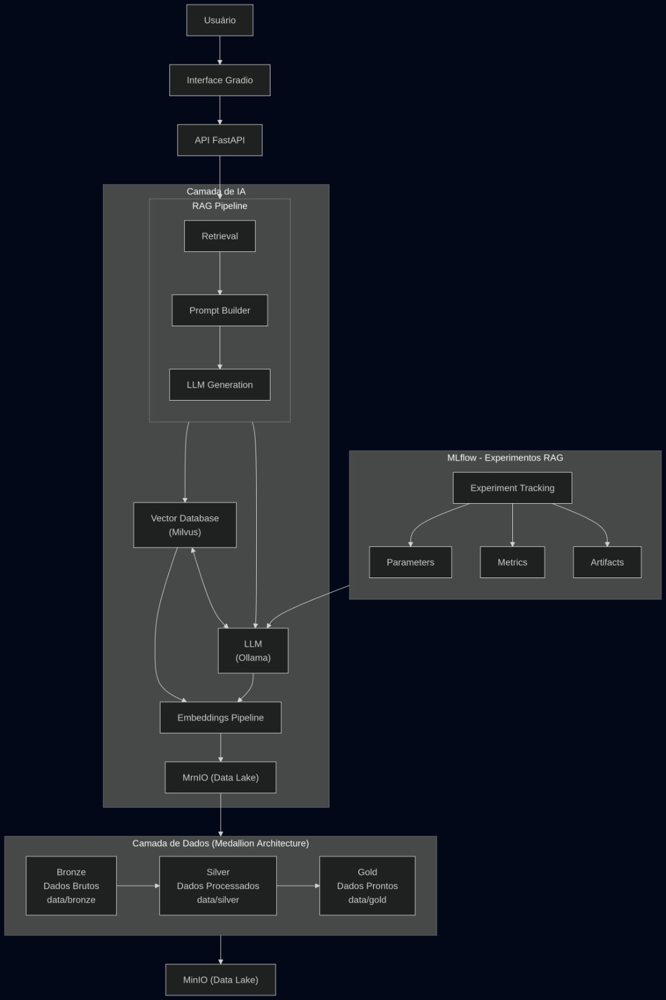

# RAG (Arquitetura Geral)

A arquitetura é composta por três pilares principais:

1. Camada de Dados
2. Camada de IA
3. Camada de Aplicação


Fluxo geral:
```
User
↓
Interface
↓
API
↓
RAG Pipeline
↓
Vector Search
↓
LLM Generation
```

Fluxo detalhado:



---

# Governança de Dados

A governança segue o padrão **Medallion Architecture**.

Camadas:

Bronze
Dados brutos ingeridos no sistema.

Silver
Dados tratados e estruturados.

Gold
Dados prontos para uso pelo pipeline de IA.

Estrutura:
```
data/
├── bronze/
├── silver/
└── gold/
```
Armazenamento realizado em **Data Lake local utilizando MinIO**.

---

# Arquitetura de Componentes

Infraestrutura:

* Docker
* Docker Compose

Banco relacional:

* PostgreSQL

Banco vetorial:

* Milvus

Data Lake:

* MinIO

LLM local:

* Ollama

Experiment Tracking:

* MLflow

API:

* FastAPI

Interface:

* Gradio

---

# Estrutura do Projeto

```
rag-platform/
│
├── docker/
│   ├── docker-compose.yml
│   └── Dockerfile
│
├── Makefile
├── README.md
│
├── config/
│   └── settings.py
│
├── data/
│   ├── bronze/
│   ├── silver/
│   └── gold/
│
├── ingestion/
│   ├── loaders.py
│   ├── chunking.py
│   └── pipeline.py
│
├── embeddings/
│   └── embedding_service.py
│
├── vector_store/
│   └── milvus_client.py
│
├── llm/
│   └── ollama_client.py
│
├── rag/
│   ├── retriever.py
│   ├── prompt_builder.py
│   └── rag_pipeline.py
│
├── database/
│   ├── db.py
│   ├── models.py
│   └── repository.py
│
├── api/
│   ├── main.py
│   └── routes/
│
├── ui/
│   └── gradio_app.py
│
├── mlops/
│   └── mlflow_tracking.py
│
└── scripts/
    ├── ingest_documents.py
    └── rebuild_index.py
```

---

# Ppl RAG

O pipeline RAG segue as seguintes etapas:

1. Ingestão de documentos
2. Chunking de texto
3. Geração de embeddings
4. Indexação vetorial
5. Busca semântica
6. Construção de prompt
7. Geração de resposta com LLM

Fluxo:

Documento
↓
Chunking
↓
Embedding
↓
Indexação no Milvus
↓
Consulta do usuário
↓
Busca vetorial
↓
Construção do prompt
↓
Geração com LLM

---

# Bibliotecas Python

Principais dependências utilizadas:

API

```
fastapi
uvicorn
```
Banco de dados
```
sqlalchemy
psycopg
```
Data Lake
```
minio
```
Vector Database
```
pymilvus
```
LLM
```
ollama
```
Experiment tracking
```
mlflow
```
Interface
```
gradio
```
Processamento de documentos
```
pypdf
```
---

# Infraestrutura (Docker)

Serviços executados no ambiente local:

* API
* Gradio
* PostgreSQL
* Milvus
* MinIO
* MLflow
* Ollama

Todos os serviços são orquestrados com **Docker Compose**.

---

# Makefile

Comandos padronizados para executar o projeto.

Exemplos:

Subir ambiente
```
make up
```
Parar containers
```
make down
```
Executar ingestão de documentos
```
make ingest
```
Recriar índice vetorial
```
make rebuild-index
```

# API

A API REST é construída utilizando **FastAPI** e possui documentação automática em:

```http://localhost:8000/docs```

Principais endpoints:

POST /ask
Consulta ao sistema RAG.

POST /documents
Upload de documentos.

GET /health
Verificação de status da aplicação.

---

# MLOps

O rastreamento de experimentos é realizado utilizando **MLflow**.

Registro de:

* parâmetros de pipeline
* prompts
* métricas de avaliação
* experimentos de RAG

Interface disponível em:

```http://localhost:5000```

---
